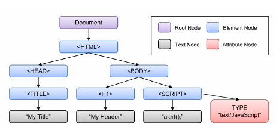

# Tower Guard

# Trivialand

_A multi-player online trivia game._

Checkout out Tower Guard [Here](https://rawbdata.github.io/TowerGuard/dist/ "Tower Guard")

***
## Background and Overview
***

Tower Guard is a JavaScript game using original Warcraft sprites with the an orignal tower defense design and implementaion. 

- Realtime: over 10 different sprite characters with up to 1000 individual renders.

- Seamless: Towers's cost, placement, animation and tracking are optimized to ensure smooth gameplay

- Collision Detection: Circular collision detection of projectiles and enemies works even if projeciles miss one character but intersect anothr.

Towerguard is built using Pure DOM manipulation to showcase a fundamental understaning of the DOM, HTML and JavaScript.

***
## Functionality & MVP
***

- [ ] Users can choose towers and place them on the board
- [ ] Game keeps track of enemies killed, current bank, health and the wave number
- [ ] Enemies are generated and animated randomly on the left side of the board
- [ ] Enemies use a pathfinding algorithm to direct themselves throughout the board to get to home castle
- [ ] Towers track and attack enemies with animated projectiles
- [ ] Collision detection lowers the health of enemies until they are removed from the board or the enemy reach the home castle

### Bonus Features

- [ ] Option to toggle sound effects and/or music
- [ ] Over 10 different enemy sprites that are timed and curated specifically for this game

***
## Challenges
The most challenging aspects of this game are:
- [] Pathfind algorithms and sprite directions derived from this algorithm
- [] Smooth sprite animation from different sizes of sprite sheets
- [] Collision detection and removal of enemies and projectiles
***

### Architecture

Trivialand is built using Dom manipulation of nodes, primarily Canvas and animation of the canvas.

The overall architecture is summarized in the diagram below:

***
## UI/UX
***

The goal is to create a unique player experience that is intuitive to use and quick to pick up. Enemy waves are increased by a certain percentage at every wave. Each enemy removed from the board gives the player more health and more coins to buy more towers. The players health decreases everytime an enemy makes it to the home castle. The game ends when the players runs out of health.

The app will have splash page with a sign up and login. Once logged in players can either create lobby or join using a unique key. Also players can see live lobbies. Players can watch any ongoing game, without being able to join. The users show page contains details regarding their stats and potential unlocks. Lobby leaderboard to see other individual stats to measure against.

